# Context
VTEX is a global SaaS technology company focused on ecommerce solutions that have a daily impact on the work of thousands of people around the world. More than 2500 leading brands of varying sizes and segments, with operations in 26 countries and in global expansion, rely on VTEX for the online sales of their products.

The main challenge of working in such environment is that the product is the same whether you're a small store or a huge commerce operation. So every solution we design has to leverage a huge diversity of user needs, and build something that works for everybody.
 
The main touchpoint of our product with the merchants is the Admin. It's where our clients configure and manage everything related to their commerce operations. It's also where most of our design efforts go into.


# Introdução

Promoções fazem parte do comércio desde seu início, desde que se começou a negociar produtos também se negociava preços que atraíssem consumidores em fechar negócio. Apesar de o ecommerce ter mudado muito a maneira como pensamos e apresentamos promoções, seus objetivos continuam os mesmos: aumentar as vendas.

```grid|1
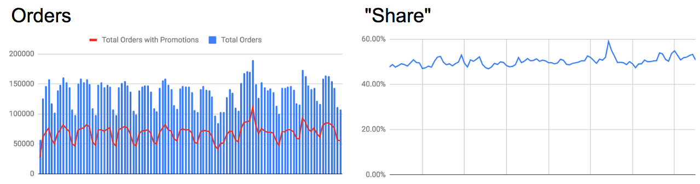
```

## Admin de Promoções
É a central para gerenciar promoções na sua loja VTEX. É usado por praticamente todos dos clientes numa frequência quase diária - são em média 5000 sessões por dia por mais de 2000 pessoas. Seus usuários variam bastante, mas normalmente estão relacionados aos times Comercial e de Marketing nas operações.

Este módulo se destaca bastante dos concorrentes pela robustez e flexibilidade que ele oferece para cadastrar os mais diversos tipos de promoções. O resultado é que pouco mais de 50% de todas vendas que passam pela VTEX usam algum tipo de promoção.

Apesar do poder do módulo e sua comprovada relevância pro negócio dos nossos clientes as diversas iterações ao longo dos anos fizeram suas telas e conceitos deixarem de fazer sentido quando vistos como um todo. Isso ficou muito claro em um papo com Soncini, que trouxe uma nova perspectiva de clientes de um mercado muito novo para a VTEX e bastante mais exigente: o dos Estados Unidos.
Isso gerava muitas dúvidas dos usuários de como usar o módulo e as várias diferentes features que foram se acumulando. Descobrimos que de todos módulos da VTEX o de promoções era o 3o com mais perguntas de clientes - foram quase 400 tickets abertos nos últimos 3 meses! Mais do que melhorar a eficiência do nosso time de Suporte para responder tickets nós sempre nos perguntamos: o que poderíamos fazer para evitar que o ticket fosse criado em primeiro lugar? Melhorar a UX é frequentemente a resposta.

```grid|1
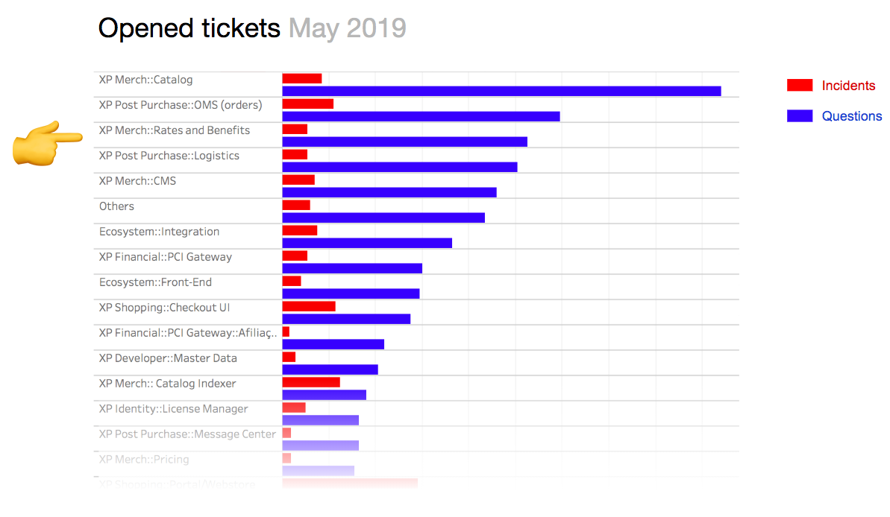
```


## Quando o produto é uma ferramenta de trabalho
Apesar de trabalhar com ecommerce nós não desenvolvemos os sites das lojas em si, estas são responsabilidade do nosso largo ecossistema de agências parceiras. O foco do time de produto é no desenvolvimento da plataforma, que deve atender necessidades de negócio complexas e abstraí-las em um sistema poderoso mas ao mesmo tempo fácil de usar.
Construir uma plataforma corporativa é muito diferente de construir um produto “de consumo”, nós somos uma ferramenta de trabalho da qual as pessoas dependem para tocar seus negócios. Isso nos leva a focar menos em encher os olhos e mais com resolver problemas reais e fazer o dia-a-dia das pessoas mais fácil e produtivo.

```grid|1
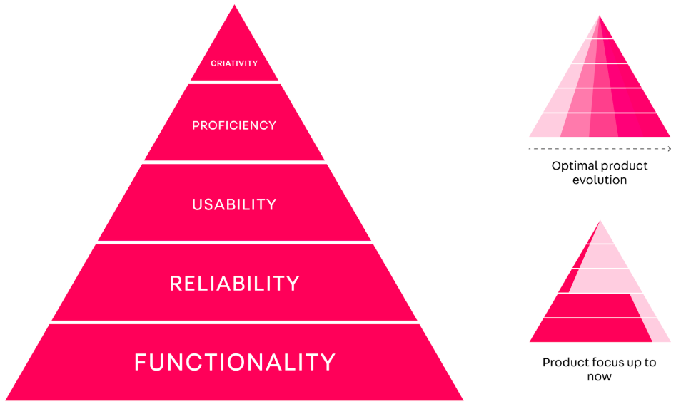
```

```grid|1
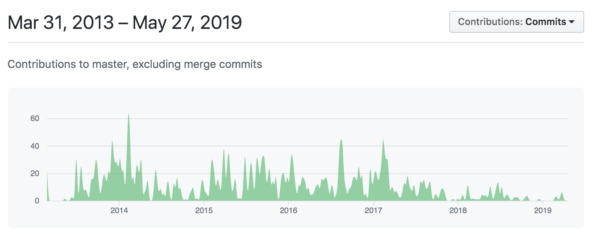
```

Ainda assim historicamente os produtos da empresa foram encabeçados pelos próprios engenheiros, que normalmente se preocupam mais com as funcionalidades do produto do que outras dimensões mais subjetivas como facilidade de uso. Com o recente crescimento do time de Design na VTEX tem se crescido a preocupação com trazer um equilíbrio a essas diferentes dimensões que formam a experiência de um produto. Uma iniciativa notável é o nosso Design System que oferece componentes prontos para criar interfaces de qualidade e consistentes entre si além de guidelines para a criação de novos admins.


# Processo

Com os insights de Soncini em mãos fomos atrás de outros stakeholders na empresa para enriquecer nossa visão de como o produto era percebido pelos clientes e quais melhorias poderíamos fazer. Nosso foco foi nos Account Managers, que são quem "defende os clientes dentro da VTEX, e defende a VTEX dentro dos clientes". Deles conseguimos entender a importância do produto nas operações, se ele tem atendido bem aos nossos clientes, como ele se compara com a concorrência e ganhamos perspectiva sobre seus potenciais e expectativas.

```grid|1
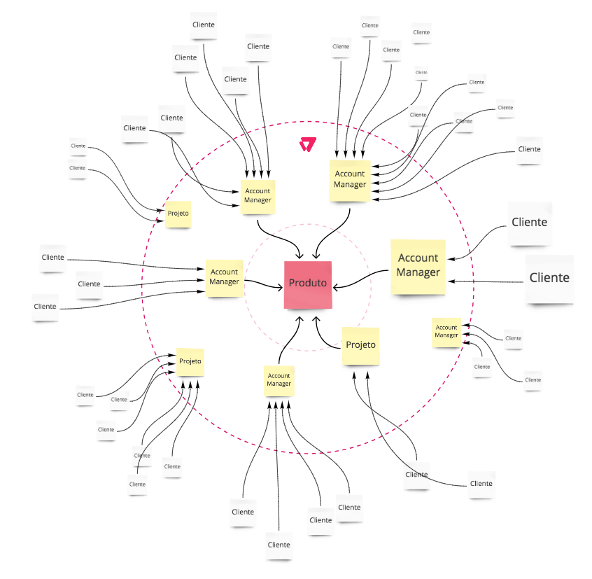
```

```grid|1
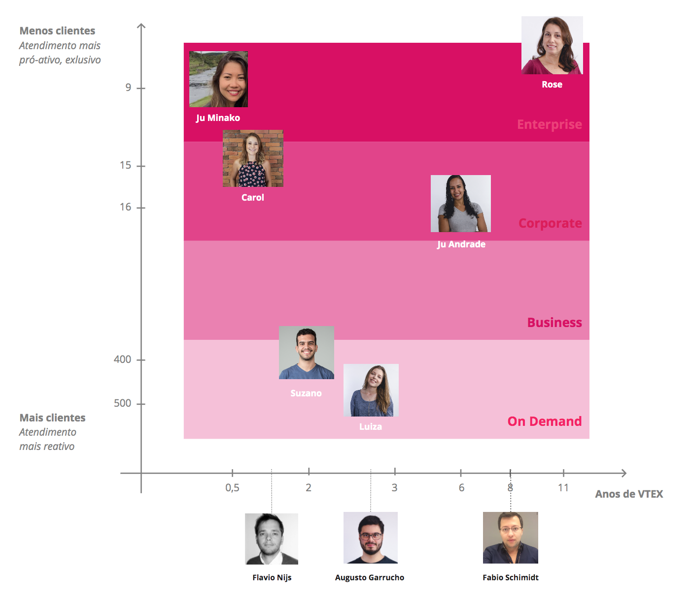
```

Os Account Managers apesar de cumprirem um papel semelhante ainda assim se diferenciam bastante por tempo de experiência na empresa e pelo tipo de carteira de clientes que atende. 

```grid|1
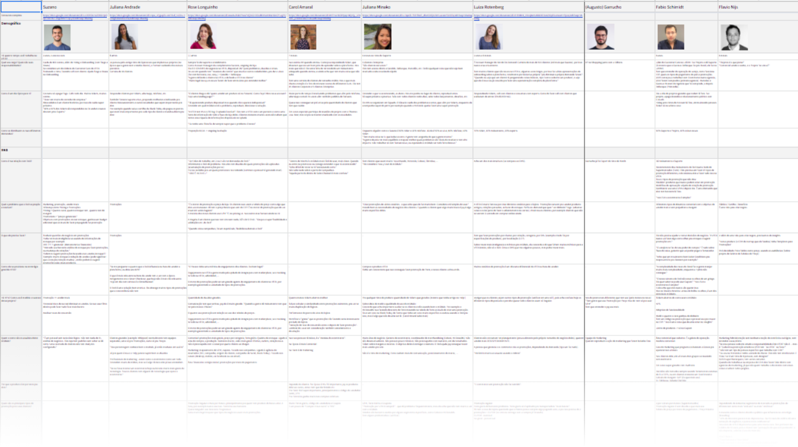
```

Após 10 entrevistas com stakeholders internos e 8 entrevistas com clientes chegamos a uma série de conclusões:
- De fato o módulo já é bastante completo em funcionalidades, se destacando da concorrência e sendo um dos "carros-chefe" nos argumentos de venda da plataforma.
- A quantidade de funcionalidades porém impacta negativamente na sua facilidade de uso. As telas não são consideradas intuitivas, geram muitas dúvidas às vezes inclusive levando o usuário a cometer erros que podem ser financeiramente desastrosos.

```grid|1


Também descobrimos que algumas iniciativas do time como o novo Conditions Builder e o sistema de Campanhas são mal compreendidos tanto internamente quanto externamente, e consequentemente são pouco usados. Isso além de um insight é sinal de uma oportunidade de repensar essas funcionalidades com a segurança de não causar impacto em clientes em produção.

<jumbo>
    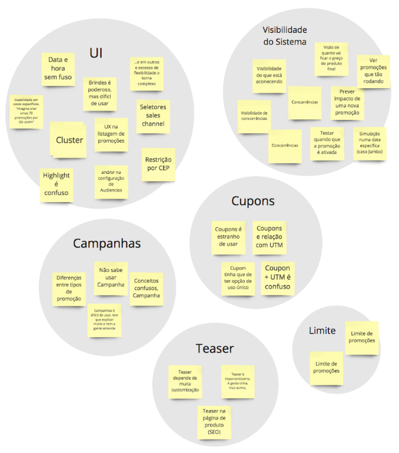
</jumbo>


## Olhando para dentro

Com várias insights e impressões de stakeholders em mãos nós nos voltamos a olhar como os usuários de fato já utilizavam promoções na VTEX. Só em Dezembro de 2018 foram mais de 60.000 promoções rodando na plataforma, o que é uma fonte riquíssima de dados de como os usuários realmente utilizam promoções em suas lojas.

Nosso primeiro passo foi validar a hipótese que os entrevistados nos trouxeram de que Promoções Regulares eram muito mais usadas que as outras. Essa hipótese não só foi confirmada como o resultado foi chocante!

```grid|1
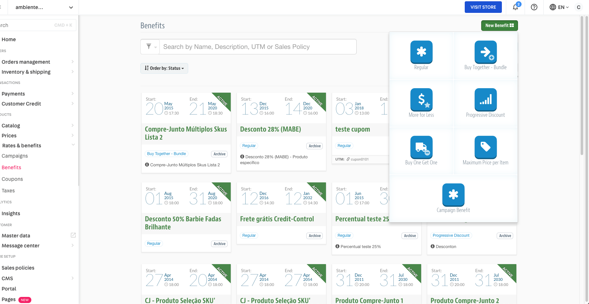
```

```grid|1
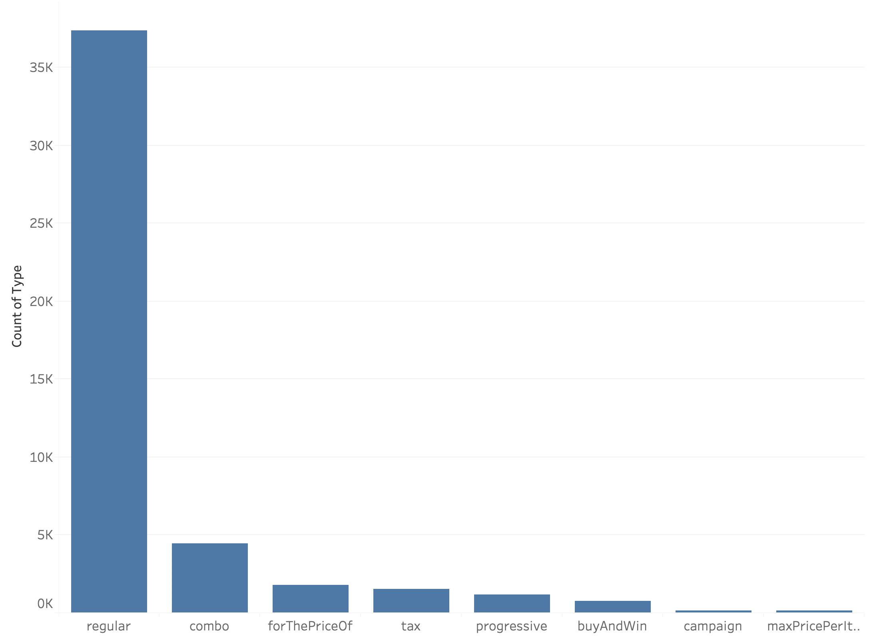
```

Outra informação muito importante pra nós foi entender o real uso das dezenas de condições especiais que o sistema funciona. 

Essa descoberta nos inspirou a detalhar melhor as funcionalidades de condições que já suportávamos e repensar quais nós continuaríamos suportando. Além disso isso nos ajudou a priorizar quais seriam as primeiras a serem trabalhadas na criação do novo admin.

```grid|1
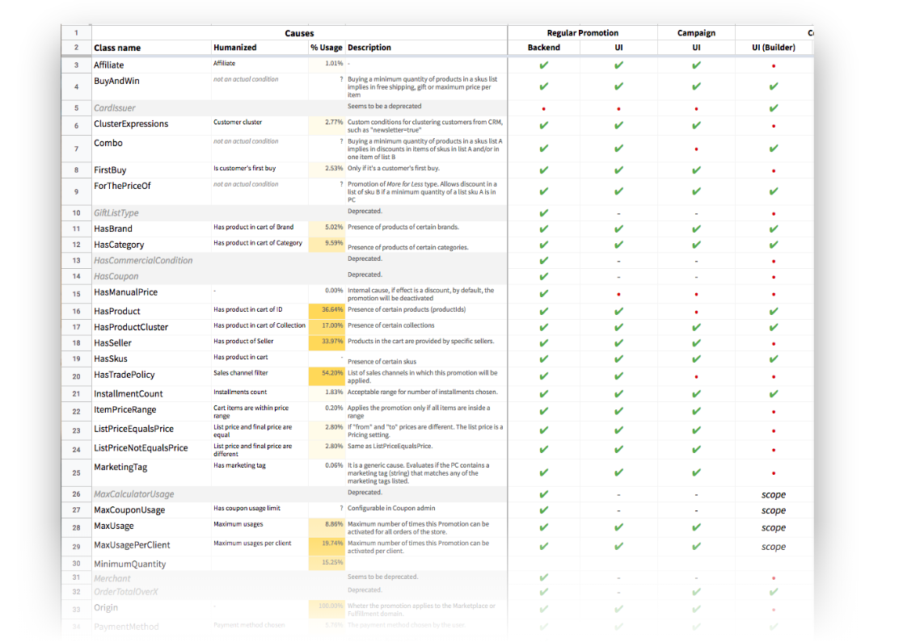
```

Quando olhamos paras datas de expiração usadas nas promoções confirmamos o que esperávamos: muitas vezes elas não fazem sentido! Usuários que queriam ter promoções que durassem "pra sempre" usavam o Datepicker selecionando a data mais distante possível, o que faz com que uma grande quantidade de promoções tenham duração configurada de 5 anos.

```grid|1
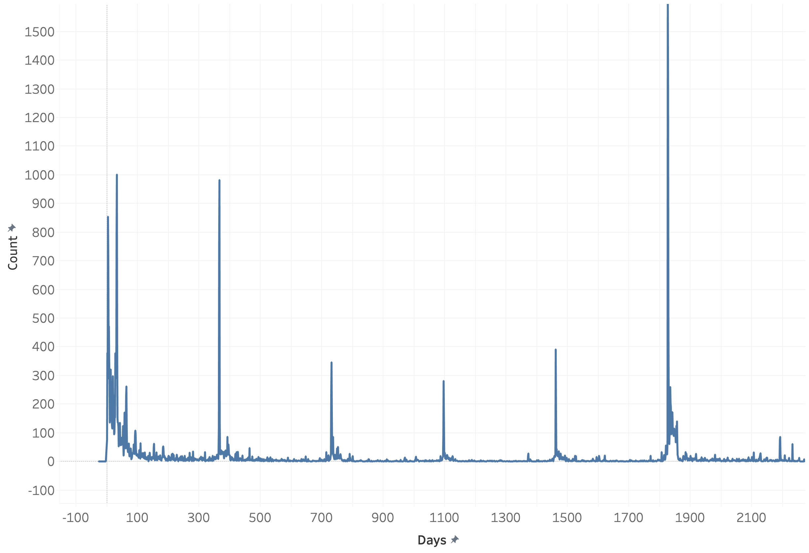
```

Quando olhamos para a distribuição de quantidade de Produtos que eram listados na parte de escopo de promoção tomamos um susto: alguns clientes chegam a fazer promoções com 999 produtos selecionados MANUALMENTE! Outros números impressionantes também foram encontrados na quantidade de categorias, coleções e marcas usados nos filtros das promoções.

```grid|1
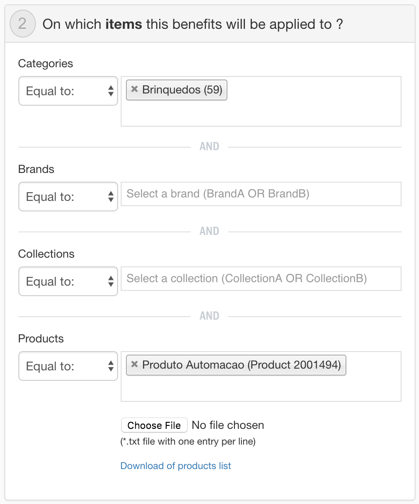
```

```grid|1
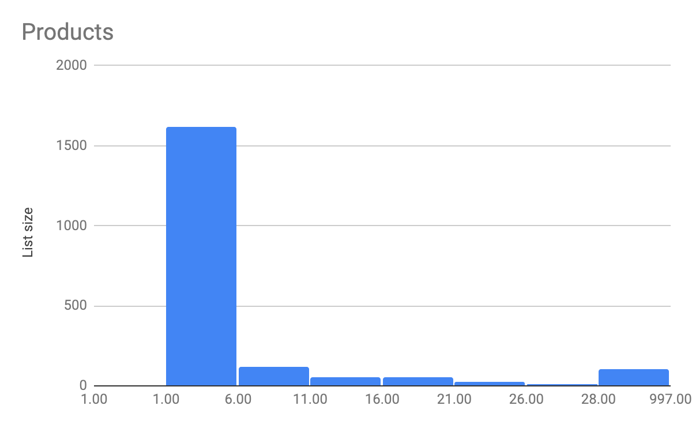
```

Abrir algumas dessas promoções que usavam listas infindáveis de itens foi um banho de água fria no time que entendeu a importância de estar mais próximo das necessidades reais dos nossos clientes!


## Olhando para o lado

No processo de pesquisa também aprendemos muito olhando com carinho para outras soluções de mercado. Entendemos de fato como a experiência que oferecíamos podia ser melhor, vimos muitas ideias legais para nos inspirar e conseguimos desenhar uma nova experiência com a clareza e segurança de que estávamos projetando algo tão bom quanto ou melhor do que o que o mercado já oferecia.

Nós olhamos para outras plataformas de ecommerce, desde as gigantes até as pequenas. Olhamos para os apps oferecidos em algumas destas plataformas, para ferramentas externas que são possíveis de serem integradas com elas e até para outras ferramentas não relacionadas a ecommerce mas que traziam conceitos semelhantes de Campanhas e Promoções.


## Problemas & soluções
O primeiro e mais notável problema eram os diferentes tipos de Promoção, cujas diferenças não eram sempre claras nem conceitualmente nem visualmente. Quando pomos lado-a-lado as telas de criação e edição dos diferentes tipos de promoção fica muito claro que as diferenças são muito pequenas, e são sempre baseadas no efeito daquela promoção. Nossa solução foi criar um tipo único de promoção.

Before:

<jumbo>
    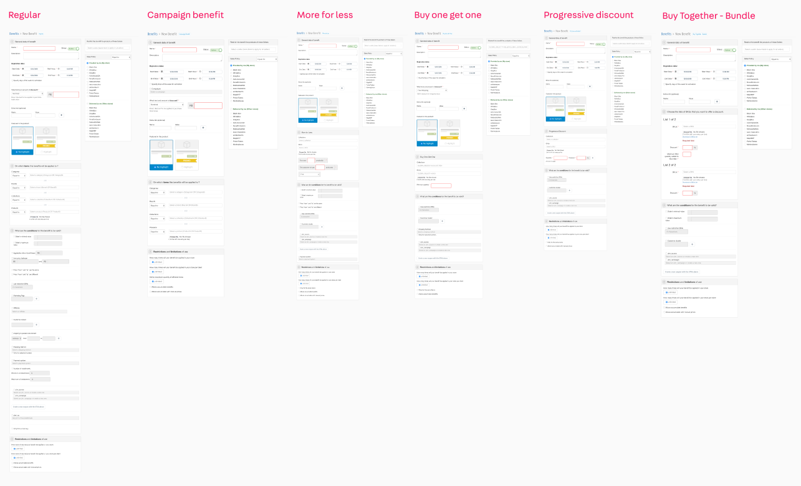
</jumbo>

After:

```grid|1
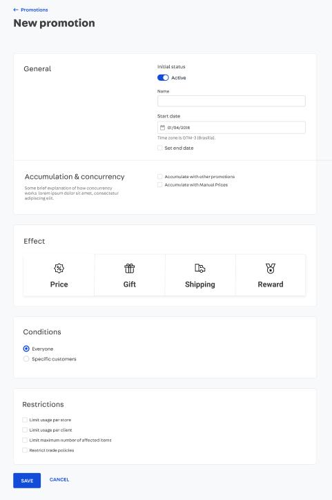
```

Soma-se a isso o sistema de Campanha e Promoção de Campanha, que, como foi dito anteriormente, causa muitas dúvidas para os usuários da plataforma, visto que o nome Campanha remete a eles um conceito muito diferente do significado adotado pela VTEX. Além disso, esse sistema trouxe ainda mais complexidade para o admin, pois adicionou uma configuração adicional fora do módulo de promoções, para que depois fosse criado um novo tipo de promoção específico para esse cenário que funciona de maneira análoga à promocão regular.


## Conditions

```grid|1
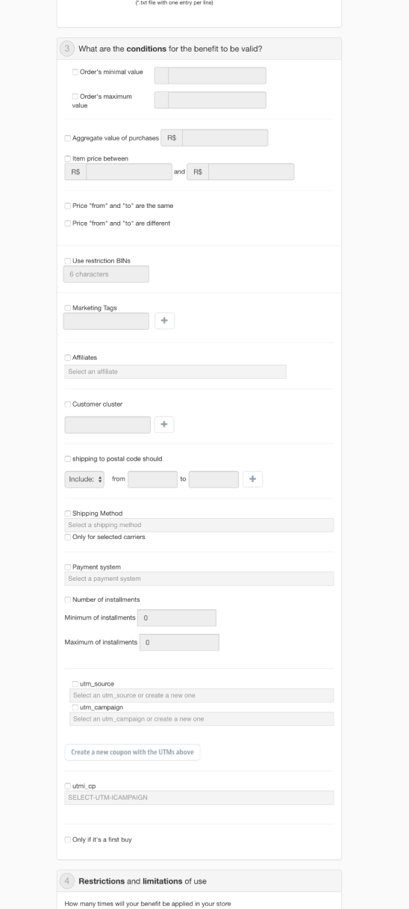
```

Sobre as condições de disparo das promoções, que é onde nossa engine hoje brilha pela quantidade de opções, acreditamos que o paradigma de interação não era o melhor. Simplesmente listando todas as opções ocorre que a complexidade da tela fica proporcional à flexibilidade do sistema, o que acaba virando um fator negativo para continuarmos evoluindo o sistema. Na nossa nova solução a complexidade inicial da tela é sempre a mesma independente da quantidade de opções que oferecemos, e esta cresce linearmente ao passo que o usuário demanda maior complexidade de regras de negócio. Resumindo, no novo paradigma a complexidade cresce com a demanda do usuário, e não com o poder do sistema.

```grid|1
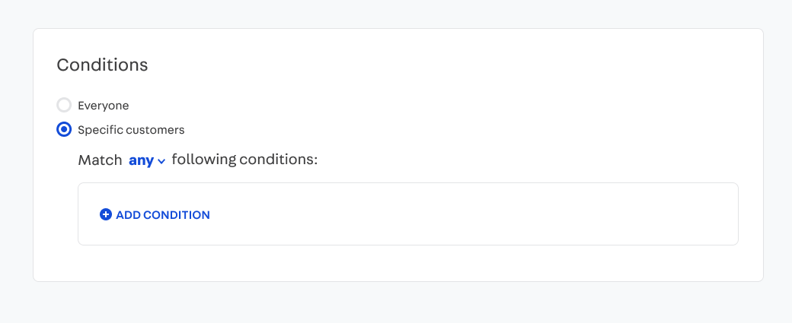
```
```grid|1
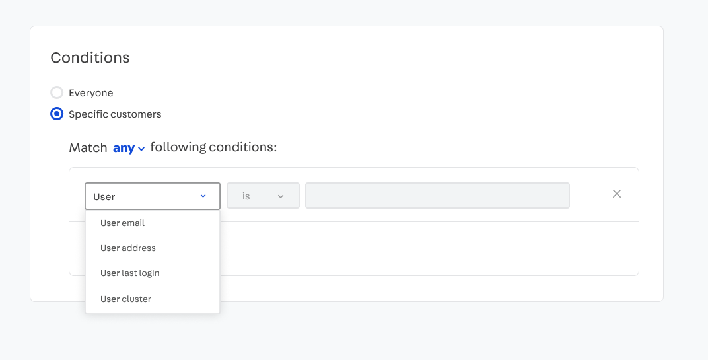
```
```grid|1
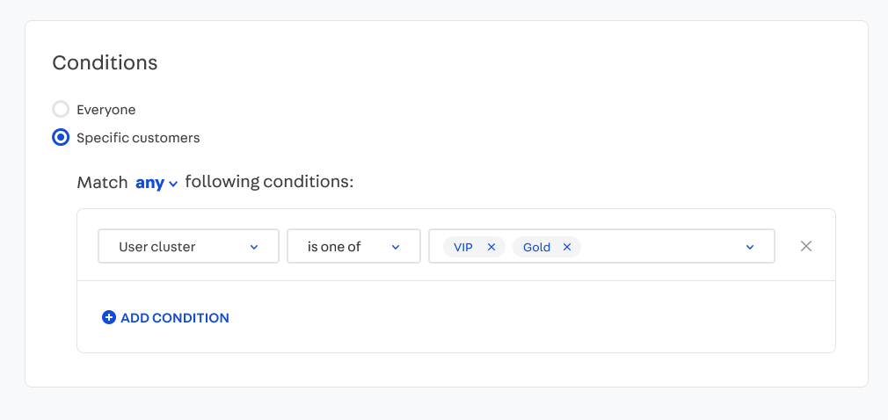
```
```grid|1
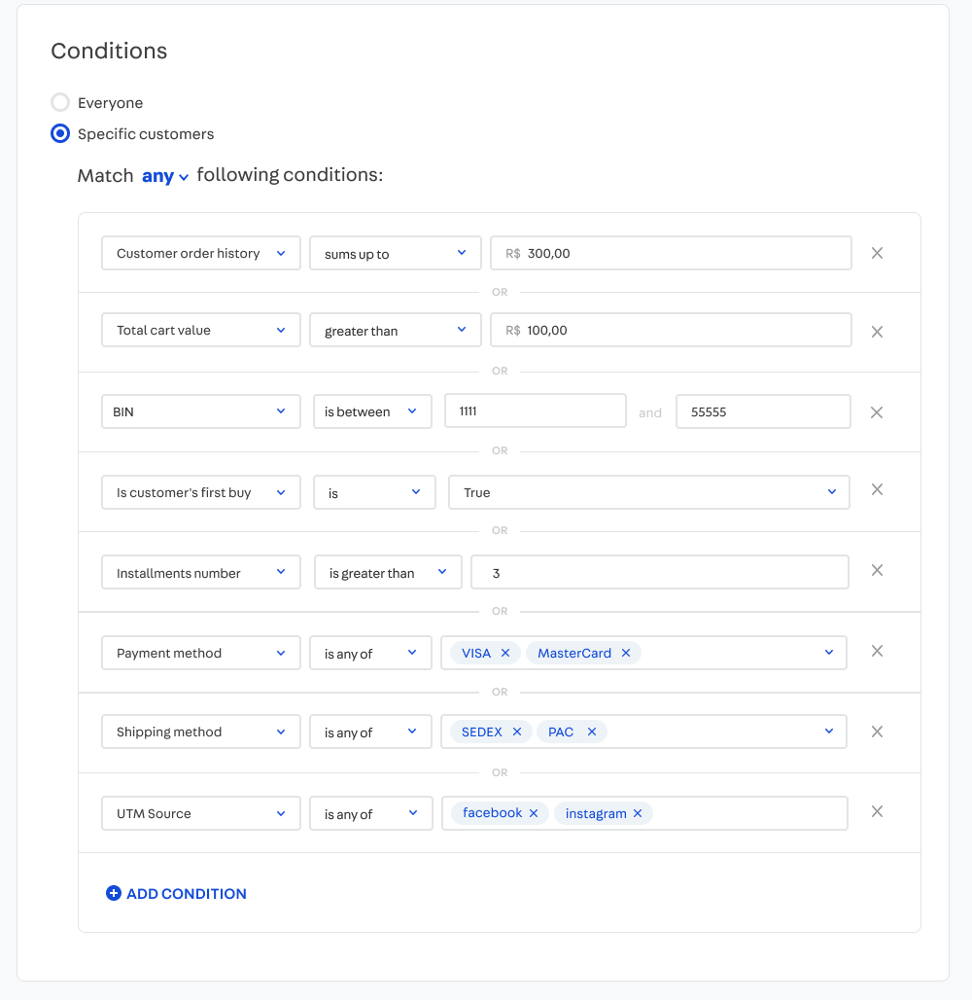
```

Uma iteração intermediária pouco conhecida deste sistema foi o Conditions Builder. Com ele foi criado um sistema novo para avaliação de causas no RnB, o Conditions Engine, que será a máquina por trás das novas promoções. O Builder, porém, usava um paradigma de crud de condições com blocos visuais e drag'n'drop que, apesar de ser bastante apelativo esteticamente, era desnecessariamente complexo e burocrático. A nova UI, que apelidamos de "inline conditions", oferece um padrão de interação muito mais acessível e intuitivo, além de ser muito mais facilmente integrado a fluxos e telas dos mais distintos. Enquanto o Builder lembrava uma lógica de programação, a nova solução lembra linguagem natural.

<jumbo caption="All the conditions the new system could support, without overwhelming the user.">
    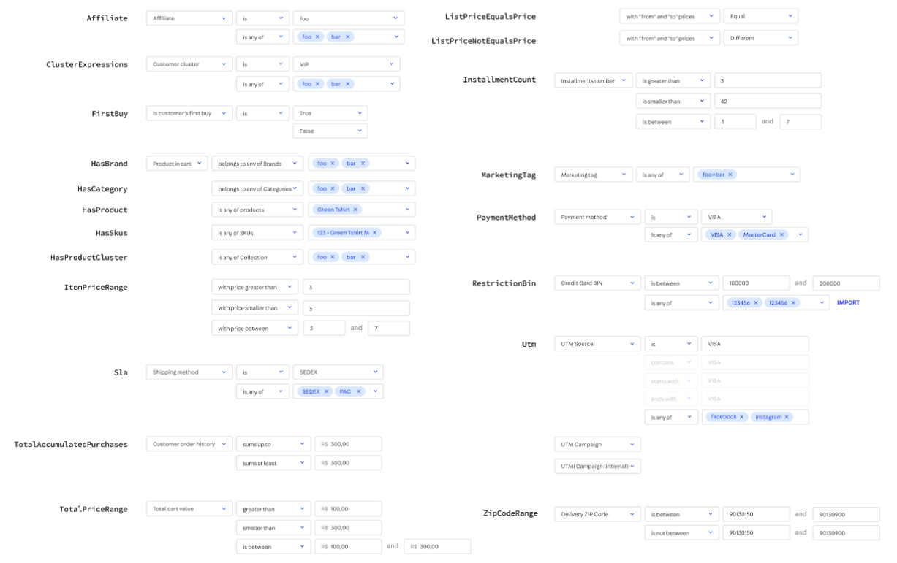
</jumbo>


## Listagem de promoções

A listagem de promoções foi mencionada por alguns também como excessivamente confusa. Ela usa um paradigma de diagramação de conteúdo popularmente conhecido como "card", que é bastante visual mas se comparado com uma simples tabela torna a comparação de dados entre as entidades algo bem mais difícil. Nossa solução foi se alavancar e evoluir o componente Table do Styleguide, desenvolvido especialmente para construção de admins complexos e poderosos sem abrir mão da clareza de informações e intuitividade.

Before:
```grid|1
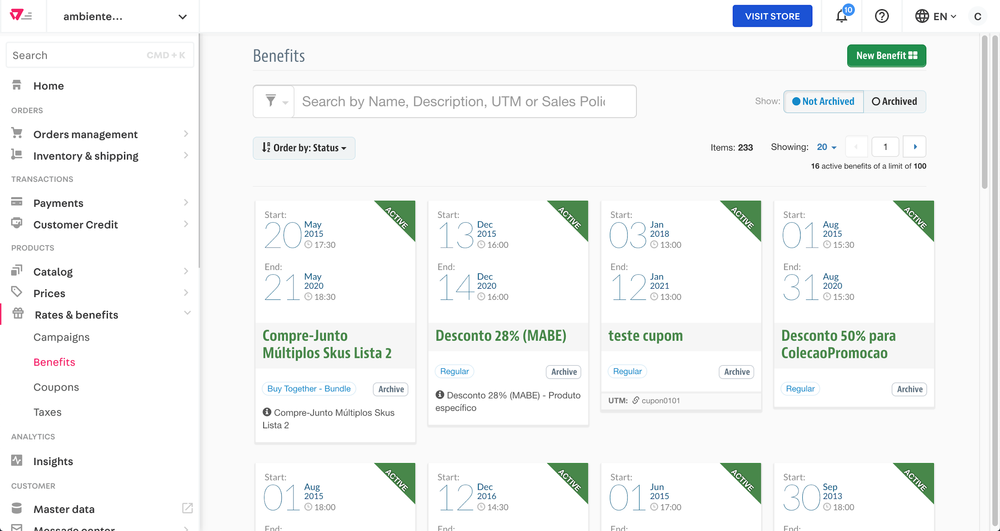
```

After:

```grid|1
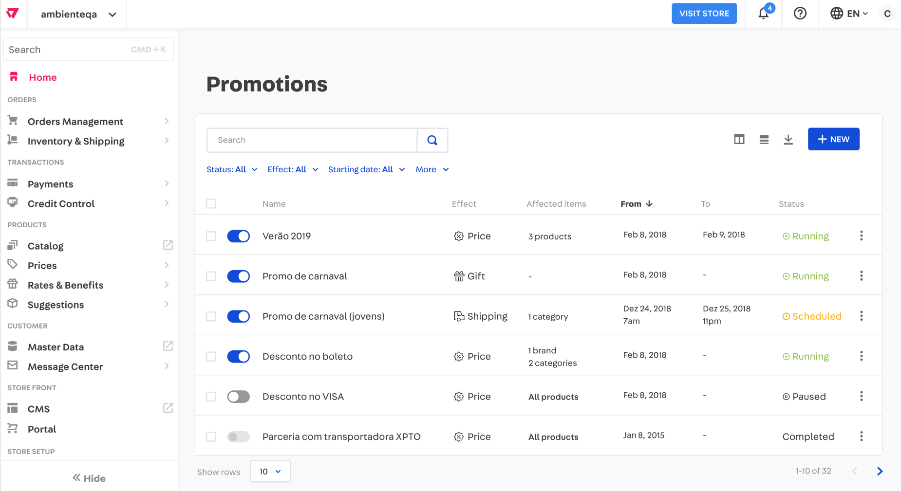
```

```grid|1


## Simulador de promoções

Outra causa comum de incompreensão do sistema vem da maneira como promoções acumulam e concorrem entre si. Isto faz com que, dado um cenário com regras de negócio complexas o suficiente, o funcionamento do sistema fica mais imprevisível, e interrelações entre dezenas de promoções podem acarretar em efeitos indesejados. Para isto estamos desenvolvendo um Simulador de Promoções onde, dado um contexto de compra (um carrinho) nós simulamos quais promoções seriam ativadas, o porquê disso e qual o efeito final. Imaginamos que isso no futuro não só facilitará "debugar" cenários indesejados assim como projetar novas regras de negócio com muito mais segurança.


## Visualização em Gantt

Para os clientes que costumam se planejar e agendar várias promoções, o novo visualizador em Gantt permitirá facilmente identificar as promoções ao longo do tempo. Ah, e também removemos a necessidade de definir uma data limite - convenhamos, nunca fez sentido obrigar isso.

```grid|1
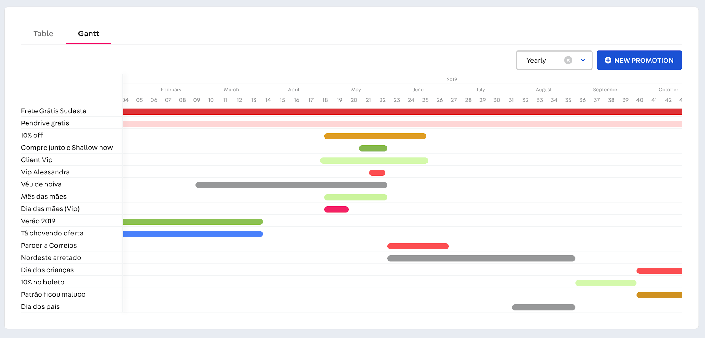
```


## Outras pequenas melhorias

Um pedido recorrente dos clientes foi para otimizar o reuso de configurações de promoções. Para isso implementamos algumas pequenas funcionalidades muito simples mas que acreditamos que irão acelerar muito o dia-a-dia de alguns usuários: a possibilidade de duplicar promoções e de criar uma após a outra.

Para a atividade comum de ligar e desligar promoções, estas ações poderão ser feitas diretamente da listagem.

Com os filtros inteligentes deixamos mais claro para os lojistas quais dados podem ser utilizados para filtrar a tabela de promoções e quais filtros estão ativos no momento.


# Trabalhos futuros
Dos principais problemas que havíamos identificado nas etapas inicias de pesquisa alguns já foram pensados e tem soluções que estão em desenvolvimento. Já outros nem começamos a olhar com carinho ainda, então há muito trabalho pela frente ainda.

Além de melhorias no sistema de promoções, há outros projetos relacionados à nossa experiência de Merchandising & Marketing que se relacionam ao módulo:

- **Audiências**: um novo sistema que encapsula as capacidades do RnB de criar públicos-alvo, servindo agora a qualquer outro módulo da VTEX que queira segmentar usuários.
- **Coupons**: repensar a ligação de coupons com promoções se desprendendo de UTM, mais flexibilidade no controle das condições de uso e gerência em massa.
- **Coleções**: redesign completo deste antigo módulo, trazendo muito mais eficiência na criação de sortimento de produtos e facilitando o reuso deles em outros módulos.
- **Métricas de performance/KPIs**: descubra se suas promoções estão lhe ajudando a vender mais e controle o seu budget direto da plataforma, sem precisar exportar planilhas do OMS e usar ferramentas externas para analisar estes dados.
- **Nested Conditions**: uma melhoria ao componente de "Conditions inline" que permitirá criar lógicas booleanas complexas.
- **Clusters**: hoje criar clusters exige conhecimentos técnicos em um dos módulos mais legados da VTEX, o Masterdata. Igualmente complicado é usar estes clusters em outros módulos, como o de Promoções.
